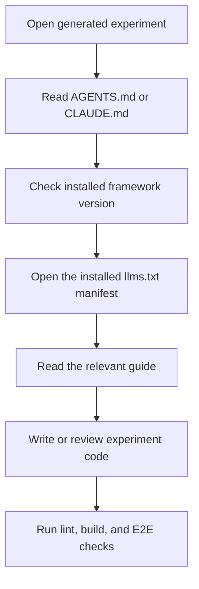

# AI project support

New experiments include `AGENTS.md` and `CLAUDE.md`. Both files are tracked, so the whole team and its coding tools start from the same rules.

`AGENTS.md` contains a small framework-managed block. `CLAUDE.md` points Claude Code to that file:

```text
@AGENTS.md
```

## How an agent finds the right guide

The framework documentation ships inside the installed package. This keeps the guidance on the same version as the code in the experiment.



The manifest links to the package's experiment-development, API, and build-and-test guides. Agents should read the smallest relevant guide and check the installed declarations or source when an edge case is not documented.

## Project-specific rules

Keep your own instructions outside these markers in `AGENTS.md`:

```md
<!-- BEGIN:experiment-framework-agent-rules -->
Framework-managed rules live here.
<!-- END:experiment-framework-agent-rules -->

# Project-specific instructions

Add experiment rules here.
```

The framework can refresh its managed block without touching the rest of the file.

## Refresh an older project

Projects generated before 2.2.0 can create or repair the instruction files after upgrading the framework dependency:

```bash
pnpm exec exp-init-agents
pnpm exec exp-init-claude
```

`exp-init-agents` replaces a valid framework-managed block and preserves everything outside it. If an existing `AGENTS.md` has no valid managed block, the command stops. Use `--force` only when you intend to replace that whole file:

```bash
pnpm exec exp-init-agents --force
pnpm exec exp-init-claude --force
```

Run these binaries from a project root containing `package.json` and either `experiment.config.js` or `src/config.js`. See [Error Reference](/error-reference) when a refresh stops to protect an existing file.
