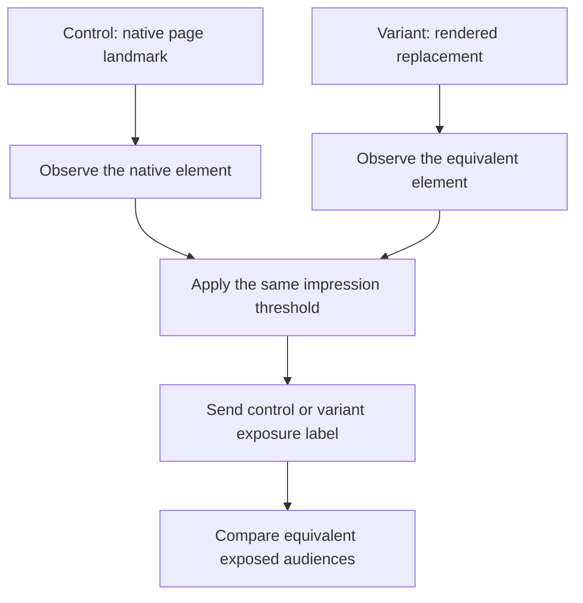

# Variations

## Variation numbering

Generated numeric variations are numbered from 1. In a standard A/B test:

- `v1` - first variant
- `v2` - second variant
- `v3` - third variant

## Scaffold an unchanged control

Use the generator flag when the control should leave the page unchanged and track only exposure:

```bash
npx @sogody/experiment-framework my-experiment --control
```

This creates `src/js/control/index.jsx` alongside the numeric variations. The generated control waits for the native element selected by `selectors.primary`, then calls `trackInView()` with experience code `c`. It does not mount a component or add styles.

Control and variant should observe equivalent landmarks with the same impression threshold:



## Add a named entry later

The existing variation command still supports a named folder:

```bash
pnpm new-variation control
```

This copies `v1`, including its UI. If the new folder represents an unchanged control, remove the mounted UI and keep only native-element tracking. Numeric folders are always ordered before named folders, so `v1`, `v2`, and `control` build in that order.

## Adding a variation

The scaffolder generates `v1` and any additional variations you requested. To add another variation later, use the generated command:

```bash
pnpm new-variation 3
pnpm new-variation control
```

These commands create `src/js/v3/index.jsx` or `src/js/control/index.jsx` from `v1`.
They also copy `src/js/v1/styles.module.scss` when present; the current scaffold
uses this file for mount-root styling.

After creation, open `src/js/v3/index.jsx` and update:

- The tracking label, for example `my-experiment: v3 cta clicked`.
- Any selectors, props, component logic, or styles specific to this variation.

Build to confirm the new variation compiles:

```bash
pnpm build
# dist/v1-index.jsx
# dist/v2-index.jsx
# dist/v3-index.jsx
```

## Developing a specific variation

```bash
pnpm start 0   # variation 1 (src/js/v1/)
pnpm start 1   # variation 2 (src/js/v2/)
pnpm start 2   # variation 3 (src/js/v3/)
```

The index is always zero-based and follows discovered build order. Numeric
folders come first, followed by named folders such as `control`.

For example, with only `v1` and `control`, run:

```bash
pnpm start 1   # src/js/control/
```

`pnpm start N` watches one variation. Restart it with a different index to switch variations.

## Production build

```bash
pnpm build
```

Builds all variations in parallel. Output:

```
dist/
├── v1-index.jsx
├── v2-index.jsx
├── vN-index.jsx
└── control-index.jsx
```

Biome runs before the build. The build aborts if linting fails.

## Prevent duplicate mounts

Adobe Target may run custom code again after an SPA route change. Because `mountExperiment` does not check for an existing instance, add a guard before mounting on SPA pages:

```js
import style from './styles.module.scss';

runScript(async () => {
    const marker = 'my-experiment-v1';
    if (document.querySelector(`[data-experiment="${marker}"]`)) return;

    const container = mountExperiment(selectors.primary, selectors.fallbacks, 'afterbegin', {
        className: style.root,
        dataset: { experiment: marker },
    });
    if (!container) return;

    render(<MyComponent />, container);
    setupTracking(container, { label: 'my-experiment: v1 cta clicked' });
});
```

Set the marker immediately after mounting so subsequent runs hit the guard.

::: warning SPA pages
If you omit the dedup guard on an SPA, the component will mount multiple times on navigation. Add it whenever the target page uses client-side routing.
:::
