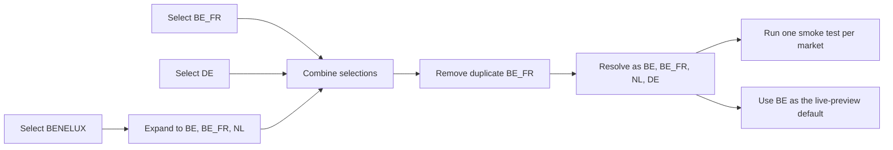

# Markets in E2E tests

See the [Markets reference](/reference/markets) for every available market and code.

## How market codes map to URLs

Each market has a `urlPath` that maps to a URL path segment on samsung.com:

| Market | Code | URL path | Example URL |
|---|---|---|---|
| United Kingdom | `UK` | `uk` | `https://samsung.com/uk/` |
| Germany | `DE` | `de` | `https://samsung.com/de/` |
| Belgium (FR) | `BE_FR` | `be_fr` | `https://samsung.com/be_fr/` |
| Netherlands | `NL` | `nl` | `https://samsung.com/nl/` |

## Select one or more markets

The generator and `pnpm add-e2e` use the same multiselect prompt. Press Space to select groups or individual markets and Enter to finish.

When you select a multi-country group, the E2E tests run against every country in it. For example, `BENELUX` generates three test iterations:

```
smoke test - Belgium (NL)    → https://samsung.com/be/
smoke test - Belgium (FR)    → https://samsung.com/be_fr/
smoke test - Netherlands     → https://samsung.com/nl/
```

This happens automatically because `urlsConfig.markets` is populated with all countries in the group, and the smoke spec loops over `urlsConfig.markets`.

Mixed selections are unioned and deduplicated. The result follows the framework's market order rather than the order in which you pressed Space:



The E2E config uses scaffold identifiers such as `BE` and `BE_FR`. Team targeting and reporting references may use canonical labels such as `BENL` and `BEFR`; do not substitute them without also updating `e2e/config.js`.

## Changing the market after scaffolding

Edit `e2e/config.js` directly:

```js
export const urlsConfig = {
    baseUrl: 'https://samsung.com',
    bundlePath: 'dist/v1-index.jsx',
    markets: [
        // Add or remove entries here
        { code: 'UK', urlPath: 'uk', name: 'United Kingdom' },
        { code: 'DE', urlPath: 'de', name: 'Germany' },
    ],
    // ...
};
```

The next test run uses the updated list. Update `experiment.config.js#targetUrl` separately if you also want `pnpm live` to open a different market.
